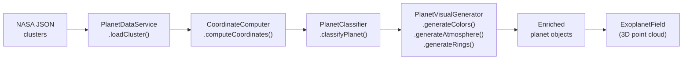
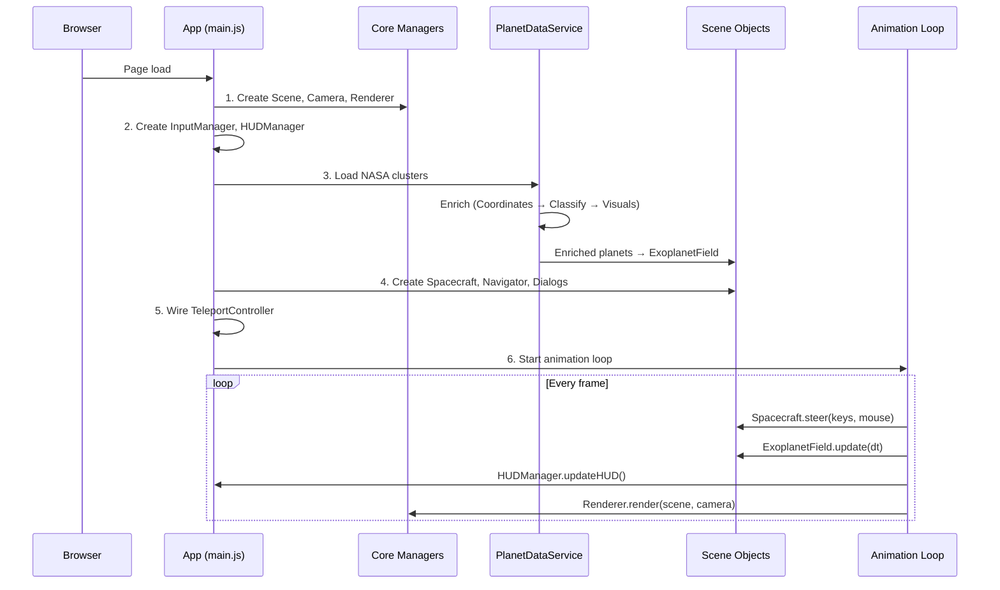
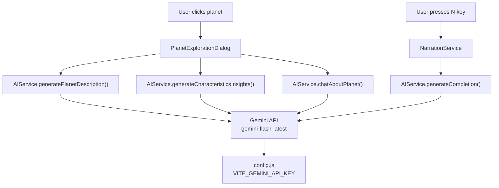

# Architecture Documentation

## Overview

A browser-based 3D space exploration application that renders 6,000+ real exoplanets using Three.js, with AI-powered planet descriptions via Google Gemini. Pure client-side — no backend server.

## Technology Stack

| Layer              | Technology                    |
|--------------------|-------------------------------|
| 3D Engine          | Three.js v0.182.0 (WebGL)     |
| Build / Dev        | Vite                          |
| AI Text Generation | Google Gemini API              |
| Module System      | ES6 modules                   |
| Async Processing   | Web Workers                   |

---

## System Architecture

```mermaid
graph TB
    subgraph Entry["Entry Point"]
        HTML["index.html"]
        MAIN["main.js<br/><i>App Orchestrator</i>"]
    end

    subgraph Core["Core Layer"]
        SCENE["SceneManager"]
        CAMERA["CameraManager"]
        RENDERER["RendererManager"]
        POST["PostProcessing"]
    end

    subgraph Controls["Controls Layer"]
        INPUT["InputManager<br/><i>Keyboard, Mouse, Raycasting</i>"]
        FLIGHT["FlightControls"]
        NAV["PlanetNavigator<br/><i>Search & Teleport UI</i>"]
        SEL["PlanetSelector"]
        CAMCTRL["CameraController"]
    end

    subgraph Objects["3D Objects"]
        CRAFT["Spacecraft"]
        EXOFIELD["ExoplanetField<br/><i>6,000+ points with LOD</i>"]
        STARS["StarField"]
        GALAXY["GalaxyField"]
        WARP["WarpTunnel"]
        DUST["SpaceDust"]
        DEBRIS["SpaceDebris"]
        PLANET["Planet"]
    end

    subgraph Services["Services Layer"]
        PDS["PlanetDataService"]
        CLASS["PlanetClassifier"]
        VIS["PlanetVisualGenerator"]
        COORD["CoordinateComputer"]
        NARR["NarrationService"]
    end

    subgraph AI["AI Layer"]
        AISVC["AIService<br/><i>Google Gemini</i>"]
        CFG["config.js<br/><i>VITE_GEMINI_API_KEY</i>"]
    end

    subgraph UI["UI Layer"]
        HUD["HUDManager"]
        DIALOG["PlanetExplorationDialog<br/><i>Info, AI Chat, Teleport</i>"]
        NARRDLG["NarratorDialog"]
        TARGET["PlanetTargetingSquare"]
        LOADING["LoadingManager"]
    end

    HTML --> MAIN
    MAIN --> SCENE
    MAIN --> CAMERA
    MAIN --> RENDERER
    MAIN --> INPUT
    MAIN --> HUD
    MAIN --> PDS
    MAIN --> CRAFT
    MAIN --> EXOFIELD
    MAIN --> DIALOG
    MAIN --> NARRDLG

    PDS --> CLASS
    PDS --> VIS
    PDS --> COORD
    PDS --> EXOFIELD

    DIALOG --> AISVC
    NARR --> AISVC
    AISVC --> CFG

    NAV -->|teleport| CRAFT
    INPUT -->|planet click| DIALOG
    INPUT -->|N key| NARR
```



---

## Module Structure

```
main.js                           App orchestrator: init, animation loop, wiring
src/
├── ai/
│   └── AIService.js              Gemini text generation
├── config/
│   ├── config.js                 Central config (env vars, API keys, feature flags)
│   └── planets.js                Static planet definitions
├── controls/
│   ├── InputManager.js           Keyboard + mouse + raycasting
│   ├── FlightControls.js         Spacecraft flight physics
│   ├── PlanetNavigator.js        Planet search / teleport UI
│   ├── PlanetSelector.js         Planet selection logic
│   ├── CameraController.js       Camera modes
│   └── OrbitControls.js          Three.js orbit controls
├── core/
│   ├── Scene.js                  SceneManager
│   ├── Camera.js                 CameraManager
│   ├── Renderer.js               RendererManager
│   └── PostProcessing.js         Post-processing effects
├── objects/
│   ├── Planet.js                 Individual planet mesh + textures
│   ├── Spacecraft.js             Player ship with flight model
│   ├── ExoplanetField.js         Point cloud (6,000+ exoplanets, LOD)
│   ├── StarField.js              Background stars
│   ├── GalaxyField.js            Galaxy background
│   ├── WarpTunnel.js             Warp speed effect
│   ├── SpaceDust.js              Particle effects
│   ├── SpaceDebris.js            Asteroid debris
│   ├── Star.js                   Sun / star object
│   └── Universe.js               Universe container
├── services/
│   ├── PlanetDataService.js      Data loading orchestrator
│   ├── PlanetClassifier.js       Pure: type classification by radius/temp
│   ├── PlanetVisualGenerator.js  Pure: colors, atmosphere, rings
│   ├── CoordinateComputer.js     Pure: 3D coords from RA/Dec/Distance
│   └── NarrationService.js       AI narration wrapper
├── ui/
│   ├── HUDManager.js             HUD updates, UI toggle
│   ├── PlanetExplorationDialog.js Planet info dialog with AI chat
│   ├── NarratorDialog.js         AI narration dialog
│   ├── PlanetTargetingSquare.js  Planet targeting overlay
│   └── PartyLoadingScene.js      Loading screen
├── utils/
│   ├── TeleportController.js     Teleport + flash + warp sound
│   ├── textureGenerator.js       Procedural texture generation
│   ├── PlanetTextureGenerator.js Solar system specific textures
│   ├── LoadingManager.js         Loading progress
│   ├── ProximityDetector.js      Nearest planet detection
│   ├── logger.js                 Leveled logging
│   └── helpers.js                Misc utilities
├── shaders/
│   └── AtmosphereShader.js       GLSL atmosphere
└── workers/
    └── textureWorker.js          Web Worker for async textures
```

---

## Data Flow: Exoplanet Pipeline



---

## App Initialization Sequence



---

## AI Integration



---

## Scale System

| Domain            | Unit                 | Scale Factor    |
|-------------------|----------------------|-----------------|
| Scene units       | 1 light-year         | 10 scene units  |
| Global multiplier | All planet positions | 10,000x         |
| Solar system      | Planetary positions  | AU-based        |
| Exoplanets        | Field coordinates    | Light-year based|

---

## Design Patterns

| Pattern                      | Where                                                      | Purpose                                           |
|------------------------------|-------------------------------------------------------------|--------------------------------------------------|
| **Manager**                  | SceneManager, CameraManager, RendererManager                | Encapsulate Three.js subsystem lifecycle          |
| **Orchestrator**             | App class in main.js                                        | Thin top-level wiring; delegates to subsystems    |
| **Pure function extraction** | PlanetClassifier, PlanetVisualGenerator, CoordinateComputer | Stateless transforms, easy to test                |
| **Callback-based DI**        | InputManager callbacks                                      | Decouple input detection from action handling     |
| **Configuration**            | config.js, planets.js                                       | Centralize all tunables and data definitions      |

---

## Performance Strategies

- **ExoplanetField LOD** — level-of-detail rendering for 6,000+ point cloud
- **Web Worker** (textureWorker.js) — offloads procedural texture generation off the main thread
- **PostProcessing pipeline** — selective effects application
- **BufferGeometry** — efficient GPU memory for star fields and particle systems
- **ProximityDetector** — spatial queries to avoid per-frame full scans

---

## Security

- API keys stored in `.env` (git-ignored)
- All API calls are client-side fetch — no secrets on a backend
- Input validation on user chat prompts

---

**Last Updated**: March 2026
**Project**: Hamburg AI Hackathon — 3D Space Exploration
**Version**: 2.1
