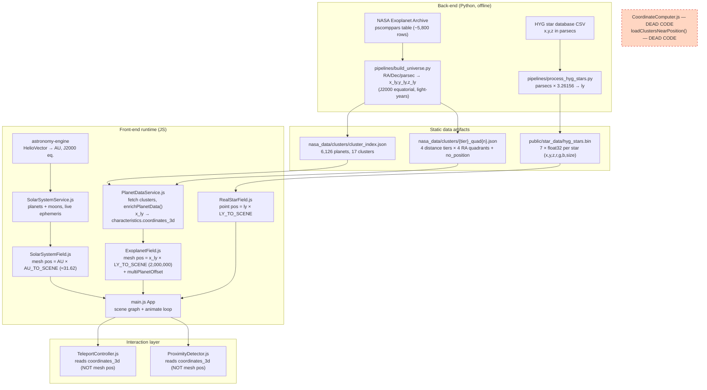
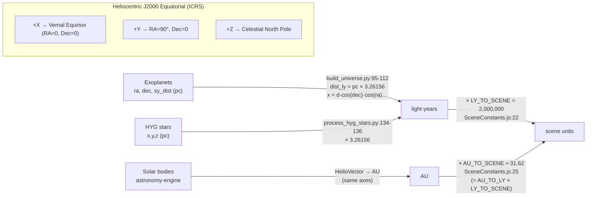
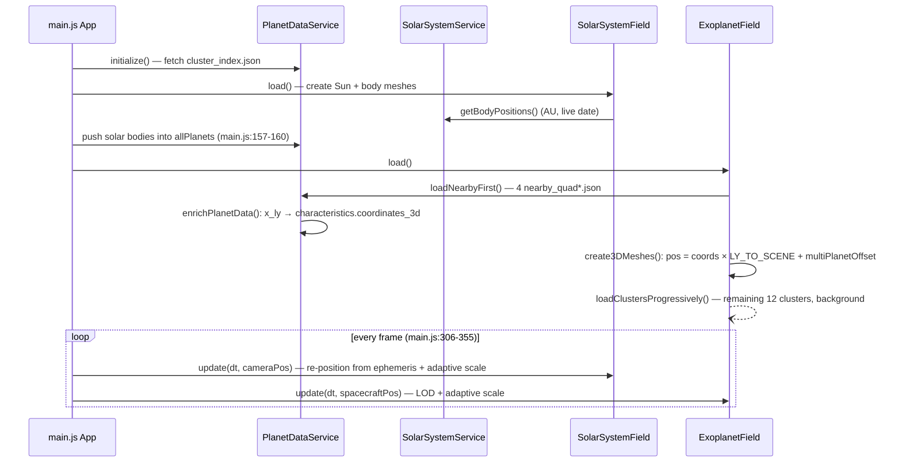
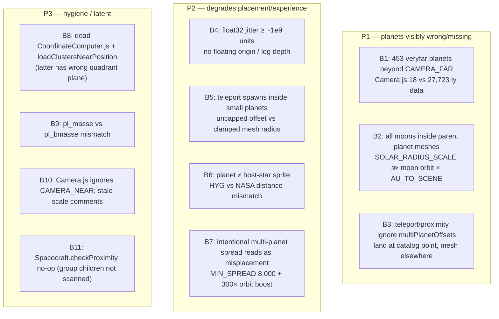
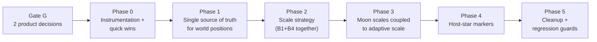

# Research: Planet Placement Pipeline (Back-end → Front-end)

## Research Question

How does the spatial data pipeline work end-to-end — from back-end extraction (`pipelines/build_universe.py`, `nasa_data/clusters/*`) through coordinate handling (`src/services/CoordinateComputer.js`) to front-end 3D representation (`ExoplanetField`, `SolarSystemField`, `main.js`)? Identify potential bugs causing planets to be misplaced in-game, and trace an iteration plan up to the front-end.

## Summary

The pipeline itself is **mathematically correct and internally consistent**: all three data sources (NASA Exoplanet Archive, astronomy-engine, HYG stars) share the Heliocentric J2000 Equatorial frame, and I numerically verified that stored `x_ly/y_ly/z_ly` values in the cluster JSONs exactly match a recomputation from `ra/dec/sy_dist`. The misplacement bugs live in the **front-end scene layer**, not in the data:

1. **453 planets sit beyond the camera far plane** (dist > 5,000 ly → position > 1×10¹⁰ scene units) and can never render.
2. **All moons are rendered inside their parent planet's mesh** (planet mesh radii are ~6–60× larger than moon orbital distances at the chosen scales).
3. **Teleport and proximity systems ignore the artificial multi-planet spread offsets** applied to meshes, so teleporting to a planet in a multi-planet system lands you at its *catalog* position while the mesh has been displaced ≥8,000 units away.
4. **Float32 GPU precision** at world positions up to 5.5×10¹⁰ units causes position quantization/jitter (classic large-world problem — no floating origin, no logarithmic depth).
5. Several smaller inconsistencies: teleport can spawn *inside* small planets; `pl_masse` is read but the pipeline writes `pl_bmasse`; `CoordinateComputer.js` and `loadClustersNearPosition()` are dead code (the latter with wrong quadrant math if ever revived).

Note also a *design* decision that reads as misplacement: `buildMultiPlanetOffsets()` **intentionally** moves planets in multi-planet systems off their catalog coordinates (min spread 8,000 units, orbit distances visually boosted 300×) so they don't overlap.

## Architecture — End-to-End Data Flow

## Coordinate Systems and Unit Conversions

All sources share one frame — verified in `planet_position_research.md` and confirmed in code:

Key scale constants (`src/config/SceneConstants.js`):

| Constant | Value | Meaning |
|---|---|---|
| `LY_TO_SCENE` | 2,000,000 | 1 ly = 2M scene units |
| `AU_TO_SCENE` | ≈31.62 | derived: `1.581e-5 × 2e6` |
| `SOLAR_RADIUS_SCALE` | 0.5 | solar-planet mesh: Earth radius = 0.5 units |
| `SOLAR_MAX_RADIUS` | 6.0 | solar planet radius cap |
| `EARTH_RADIUS_SCALE` | 5,000 | exoplanet mesh: Earth radius = 5,000 units |
| `MIN/MAX_PLANET_RADIUS` | 2,000 / 50,000 | exoplanet mesh radius clamp |
| `CAMERA_FAR` | 1×10¹⁰ | = 5,000 ly — **less than max planet distance (27,723 ly)** |

Note the **dual radius scale**: solar planets use 0.5/Earth-radius, exoplanets use 5,000/Earth-radius (10,000× difference), both compensated at runtime by per-frame "adaptive scale" inflation (`SolarSystemField.js:16-26`, `ExoplanetField.js:17-23`).

## Load Sequence

## Detailed Findings

### 1. Back-end pipeline (`pipelines/build_universe.py`)

- `to_cartesian_ly()` (`build_universe.py:95-112`) — standard spherical→cartesian; heliocentric J2000 equatorial; rounds coords to 2 decimals (~0.01 ly ≈ 20,000 scene units of quantization — larger than planet meshes, but uniform, not a "misplacement").
- Tier/quadrant bucketing (`build_universe.py:221-242`): tier from `dist_ly` (0–100/500/2000/∞), quadrant from `ra` (90° slices).
- `write_cluster()` splits files > 20 MB into `_a/_b` (`build_universe.py:245-261`); current dataset needs no splits (index shows 16 + no_position).
- **Verified numerically**: for sample planets in `nearby_quad1.json`, stored `x_ly/y_ly/z_ly` match recomputation from `ra/dec/sy_dist` exactly. **The data on disk is correct.**
- Current data: 6,126 planets, generated 2026-04-07, max `dist_ly` = 27,723.26.

### 2. Data loading (`src/services/PlanetDataService.js`)

- `enrichPlanetData()` (`PlanetDataService.js:47-92`) maps flat `x_ly/y_ly/z_ly` → `characteristics.coordinates_3d.{x,y,z}_light_years`. This is the **only** live coordinate mapping path.
- `getAllPlanets()` (`PlanetDataService.js:241-261`) filters to planets with valid `coordinates_3d` and dedups by `pl_name`.
- Solar bodies are pushed into `allPlanets` by `main.js:157-160` with `position` in AU (no `coordinates_3d`), so downstream code special-cases them via `isSolar`/`hostname === 'Sun'`.

### 3. Dead code

- `src/services/CoordinateComputer.js` — `computeCoordinates()` has **zero callers** (grep across `src/` + `main.js`). It duplicates the pipeline math and would look for `characteristics.coordinates_3d` first.
- `PlanetDataService.loadClustersNearPosition()` (`PlanetDataService.js:156-203`) — never called. If revived it has a latent bug: quadrant from `atan2(position.z, position.x)` (`:168-169`), but pipeline quadrants are RA-based, i.e. `atan2(y, x)` in the equatorial frame. Wrong plane.

### 4. Exoplanet rendering (`src/objects/ExoplanetField.js`)

- Mesh position: `coords × LY_TO_SCENE` plus an **artificial multi-planet offset** (`ExoplanetField.js:361-372`).
- `buildMultiPlanetOffsets()` (`ExoplanetField.js:47-103`): groups by `hostname`; for systems with ≥2 planets, arranges planets on a ring around the catalog point with radius = max(8,000 units, separation clearance, `pl_orbsmax × AU_TO_SCENE × 300`, …). **Planets in multi-planet systems are deliberately not at their catalog coordinates.**
- `userData.basePosition` stores the *unoffset* position (`ExoplanetField.js:377-381`); `applyMultiPlanetLayout()` re-applies offsets after each batch.
- Adaptive scaling (`ExoplanetField.js:17-23`, applied in `updateLOD` `:638-644`): inflates any planet below 3 px to 3 px, capped per system so neighbors don't merge (`updateSystemScaleCaps` `:467-501`).
- Skip guard `coords.x_light_years === null` (`:220`) — does not catch `undefined`, but `enrichPlanetData` only creates the object when `x_ly != null`, so `!coords` covers the practical case.
- `getPlanetAtPosition()` (`:773-784`) uses base coords, ignores offsets, and a default radius of 5 scene units (2.5×10⁻⁶ ly).

### 5. Solar system (`SolarSystemService.js`, `SolarSystemField.js`)

- `getBodyPositions()` returns heliocentric AU for 9 planets (astronomy-engine `HelioVector`), the Moon (Earth + `GeoVector`), and 13 major moons via simple circular orbits around the parent (`SolarSystemService.js:150-243`).
- `SolarSystemField.update()` re-positions every mesh each frame: `position × AU_TO_SCENE` (`SolarSystemField.js:86-90`).
- Mesh radius: `clamp(pl_rade × 0.5, 0.1, 6.0)` (`:243`).
- **Scale collision**: Moon orbital distance = 0.00257 AU × 31.62 ≈ **0.081 scene units**, but Earth's mesh radius is **0.5** → the Moon is *inside* Earth. Io: 0.00282 AU ≈ 0.089 units vs Jupiter mesh radius 5.6 → all Jovian moons are deep inside Jupiter's mesh. Every moon in `PLANET_MOONS` is affected. Adaptive inflation of the parent makes it worse.

### 6. Camera and precision (`src/core/Camera.js`, `SceneConstants.js`)

- `Camera.js:14-20` hardcodes `near = 0.1`, `far = 10_000_000_000` — ignores `CAMERA_NEAR = 0.01` from SceneConstants (duplication drift).
- `far` = 1×10¹⁰ units = 5,000 ly. **453 planets in the `veryfar` tier are farther** (up to 27,723 ly = 5.5×10¹⁰ units) — meshes exist but are beyond the far plane when viewed from the solar-system region.
- Float32 GPU math: at 5.5×10¹⁰ units, float32 spacing is ~4,096 units; even at 2×10⁹ (1,000 ly) it's ~256 units. Camera-relative rendering happens in float32 on the GPU with no floating-origin rebasing → visible jitter/swimming when near distant planets after teleporting.
- `near/far` ratio 10¹¹ with a standard depth buffer → severe depth precision loss (mitigated in practice by draw ordering: stars `depthWrite:false, renderOrder:-999`; planets `renderOrder:10`).

### 7. Teleport & proximity (`TeleportController.js`, `ProximityDetector.js`)

- Both compute planet positions from **raw data** (`coordinates_3d × LY_TO_SCENE` or `position × AU_TO_SCENE`) — **not** from the mesh — so both are blind to `multiPlanetOffsets` (`TeleportController.js:26-33`, `ProximityDetector.js:51-63`).
  - Teleport to a planet in a multi-planet system: ship lands `pl_rade × 5000 × 1.5` units from the *catalog* point; the mesh is ≥8,000 units away on the spread ring → planet is not where the camera looks.
- Teleport approach offset for exoplanets uses **uncapped** radius (`pl_rade × EARTH_RADIus_SCALE × 1.5`, `TeleportController.js:46-48`) while mesh radius is clamped to [2,000, 50,000]:
  - `pl_rade < ~0.27`: offset < 2,000 → ship spawns **inside** the mesh.
  - `pl_rade > 10`: offset ≥ 75,000 vs mesh 50,000 → planet appears small/far.
- Approach direction is radial from origin (`targetPosition.clone().normalize()`, `:50-51`) — fine except at positions near origin.
- Stale comment `SOLAR_RADIUS_SCALE=0.3, EARTH_RADIUS_SCALE=1000` (`:42`) — actual values 0.5 / 5,000.
- `ProximityDetector.searchRadius = 5,000,000` units = 2.5 ly (`:16`) — from the solar system, no exoplanet is ever "closest" (Proxima ≈ 4.24 ly); solar bodies only. Whether intended is unclear.

### 8. Star field (`src/objects/RealStarField.js`, `pipelines/process_hyg_stars.py`)

- Stars: HYG pre-computed equatorial x,y,z parsecs × 3.26156 → ly → × LY_TO_SCENE (`RealStarField.js:36-38`). Same frame as planets ✓.
- **Catalog mismatch**: a host star's HYG (Hipparcos/Gaia) distance rarely equals NASA's `sy_dist` for its planets. A few-percent distance disagreement at 100 ly = millions of scene units → the planet dot does **not** sit on its host star's sprite. Perceived as "planet in the wrong place" even though each dataset is self-consistent.
- Also: exoplanet host stars aren't specifically marked; there is no link between a rendered planet and any star sprite.

### 9. Misc

- `Spacecraft.checkProximity()` receives `scene.children.filter(obj => obj.userData.planetData)` (`main.js:334-335`), but planets live *inside* `Group`s (`SolarSystem_Group`, `NASA_Exoplanets_3D`) whose own `userData` has no `planetData` → the filter returns nothing → planet safety-braking is a no-op.
- `ExoplanetField` reads `planet.pl_masse` (`ExoplanetField.js:256,298,317`) but the pipeline writes `pl_bmasse` → always falls back to 1.0 (cosmetic: affects colors only).
- Spacecraft spawns at `(0, 50, 150)` scene units (`Spacecraft.js:16`), inside the solar system; camera initial pos `(0, 200, 500)` is immediately overridden by `updateCamera` each frame.

## Bug Register (ranked)

| # | Bug | Evidence | Effect |
|---|-----|----------|--------|
| B1 | Far-plane clipping | `Camera.js:18` far=1e10; 453 planets at >5,000 ly (measured) | veryfar planets never visible |
| B2 | Moons inside planets | Moon 0.081 units vs Earth mesh 0.5 (`SolarSystemService.js:95`, `SolarSystemField.js:243`) | moons invisible/misplaced |
| B3 | Offset-blind teleport/proximity | `TeleportController.js:26-33`, `ExoplanetField.js:361-372` | teleport lands off-target in multi-planet systems |
| B4 | Float32 world-space precision | positions up to 5.5e10 units | jitter/swimming far from origin |
| B5 | Teleport inside mesh | offset `pl_rade×5000×1.5` vs `MIN_PLANET_RADIUS` 2,000 | spawn inside planet if `pl_rade<0.27` |
| B6 | Star/planet catalog mismatch | HYG vs `sy_dist` | planet not on host-star sprite |
| B7 | Artificial spread | `ExoplanetField.js:25-27,47-103` | catalog-position expectation broken (by design) |
| B8 | Dead code | zero callers (grep) | confusion; wrong math if revived |
| B9 | `pl_masse` never present | pipeline writes `pl_bmasse` | color fallback only |
| B10 | Constant drift | `Camera.js:17-18`, `TeleportController.js:42` | maintenance hazard |
| B11 | Proximity filter no-op | `main.js:334` top-level children only | no speed braking near planets |

## Iteration Plan v2 (back-end → front-end)

> v1 of this plan was reviewed LLM-as-judge (see "Plan Review" section below) and revised:
> decision gate moved up front, quick wins pulled forward, the far-plane/precision
> contradiction resolved via an explicit scale-strategy decision, moon fix coupled to
> adaptive scaling, star-join feasibility corrected, and acceptance criteria made
> measurable with rollback notes per phase.

**Gate G — Product decisions (blocks everything downstream)**
Two questions shape Phases 1–4; decide first, in writing:
1. **Spread policy (B7)**: keep artistic multi-planet spread (8,000-unit min, 300× orbit boost) or move toward catalog-faithful positions with minimal separation? Affects Phase 1 canonical-position definition and Phase 4 constants.
2. **Veryfar policy (B1/B4)**: should planets >5,000 ly render at true distance, or is compressing/capping them acceptable? Determines Phase 2 option choice.

**Phase 0 — Instrumentation + zero-risk quick wins**
- Debug helper (`window.debugPlanet(name)`): prints catalog `x_ly` → expected scene pos → `mesh.getWorldPosition()` → delta; plus `window.debugPlacementReport()` dumping the four references (Proxima Cen b 4.24 ly, TRAPPIST-1 system ~40 ly, Kepler-452 b ~1,800 ly, one planet >5,000 ly) as a table.
- Quick wins now, not in Phase 5 (one-liners, zero behavioral risk): `pl_masse` → `pl_bmasse` (B9); `Camera.js` uses `CAMERA_NEAR/CAMERA_FAR` constants (B10); delete stale scale comments (`TeleportController.js:42`).
- Acceptance (measurable): report shows delta = 0 for single-planet systems, delta = spread offset for TRAPPIST-1, mesh-exists = false for the veryfar reference. Commit the printed table into the research doc as the baseline.
- Rollback: none needed (debug-only + renames).

**Phase 1 — One source of truth for positions (fixes B3, B5, part of B7)**
- Canonical position = final mesh world position. Expose `ExoplanetField.getPlanetWorldPosition(pl_name)` returning `basePosition + multiPlanetOffset`, **computed from data even when the mesh doesn't exist yet** — teleport can target planets whose cluster is still loading (progressive load, `ExoplanetField.js:163-183`) or whose batch hasn't been processed (`requestIdleCallback` batching, `:443-450`). Offsets must therefore be derivable without a mesh: factor `buildMultiPlanetOffsets` so the lookup uses the same function, and accept that a planet's offset can change once its siblings load — teleport should re-resolve at fire time, not cache.
- `TeleportController` and `ProximityDetector` resolve through this API (and `SolarSystemField.bodyMeshes` for solar bodies); delete their private coordinate math.
- Teleport approach offset: clamp radius with the same `MIN/MAX_PLANET_RADIUS` clamp as the mesh, i.e. `offset = clamp(pl_rade × EARTH_RADIUS_SCALE, 2_000, 50_000) × 1.5` → offset is always ≥ 1.5× mesh radius, spawn-inside-mesh impossible by construction.
- Acceptance: automated — teleport to each TRAPPIST-1 planet, assert `spacecraft.position.distanceTo(mesh.getWorldPosition()) ∈ [meshRadius, 3×meshRadius]`; assert same invariant for a `pl_rade = 0.2` planet. Manual: targeted planet centered on screen.
- Rollback: API is additive; old code paths deletable in a separate commit so revert is one `git revert`.

**Phase 2 — Scale strategy: B1 and B4 are one problem, solve together**
v1 proposed raising `CAMERA_FAR` to 6×10¹⁰ + log depth. Judge review flagged: raising far *worsens* float32 jitter (B4), and `logarithmicDepthBuffer` silently breaks every custom `ShaderMaterial` (`RealStarField`, atmosphere shaders, sun glow) unless each adds the logdepth shader chunks — plus it disables early-z. Choose deliberately:

| Option | What | Fixes | Cost/Risk |
|---|---|---|---|
| A. Shrink `LY_TO_SCENE` 2e6 → 2e5 | One constant; max position drops to 5.5×10⁹ (inside current far plane, float32 spacing ~512 units ≈ planet-radius scale) | B1 **and** B4 with no renderer changes | All derived constants shift (AU_TO_SCENE → 3.16); radius/LOD/spread constants need same-factor review; solar system shrinks below near plane? No — near=0.01 fine. Biggest blast radius, best end state |
| B. Raise far to 6×10¹⁰ + log depth | v1 approach | B1; B4 worsens | Must patch 3 custom shaders with logdepth chunks; perf cost; jitter at veryfar likely visible |
| C. Compress veryfar tier radially (log-scale beyond 5,000 ly) | Pipeline or load-time remap of `dist_ly > 5000` | B1; B4 unchanged | Positions knowingly non-physical; breaks "catalog-faithful" if Gate G chose fidelity |

Recommendation: **Option A** — it is the only one that fixes both bugs and needs no shader surgery. Do it as a single commit touching only `SceneConstants.js` scale block + a sweep of the constants listed there, validated by the Phase 0 report (all deltas must stay 0) plus screenshots of the four references.
- Floating-origin rebasing: keep as a *deferred* item, only if jitter remains visible after A at the nearest-planet views.
- Acceptance: veryfar reference planet visible from spawn direction; no visible jitter at Kepler-452 b after teleport (record 5-s screen capture); Phase 0 report deltas still 0.
- Rollback: single-commit revert.

**Phase 3 — Moon scale, coupled to adaptive scale (fixes B2)**
v1's option (a) (boost moon orbit distances) is insufficient alone: parents inflate via `adaptiveScale` (`SolarSystemField.js:93-98`), so any fixed orbit boost is re-swallowed when the camera is far. Fix must couple the two:
- Moon world position = `parentMesh.position + orbitDirection × max(orbitDist × AU_TO_SCENE × BOOST, parentMesh.scale.x × parentRadius × 1.8)` — i.e. moon orbit floor tracks the parent's *current inflated* radius each frame in `SolarSystemField.update()`.
- Acceptance: Moon, Io, Titan outside parent silhouette at (a) close range and (b) 1,000-unit camera distance — assert `moonMesh.position.distanceTo(parent.position) > parent.scale.x × parentRadius` in the debug report at both ranges.
- Rollback: isolated to `SolarSystemField.update()`/`SolarSystemService` moon block.

**Phase 4 — Host-star markers (addresses B6, rest of B7)**
v1's option (a) (join HYG↔NASA by hostname and snap star sprites) is judged **not feasible as default**: HYG identifies stars by HIP/HD/Gliese/proper name; NASA `hostname` strings (e.g. "Kepler-452", "TRAPPIST-1") mostly have no HYG counterpart at all — most host stars are simply absent from HYG (mag-limited catalog). Therefore:
- Default: **(b) render a host-star marker** (small emissive sprite, `st_teff`-tinted) at each planetary system's catalog center, generated by `build_universe.py` as a per-system `systems.json` (hostname, x_ly, y_ly, z_ly, st_teff, planet count). Planet spread ring then visibly orbits *its own* star.
- Optional follow-up: for the ~dozens of bright hosts that DO exist in HYG (match on HIP/HD where NASA provides them — not on name strings), suppress the duplicate HYG point within ~0.5 ly of a marker to avoid double stars.
- Revisit spread constants per Gate G decision now that teleport uses mesh positions.
- Acceptance: Proxima b, TRAPPIST-1 planets visually attached to a star marker; no doubled star for Proxima (it is in HYG).
- Rollback: markers are an additive scene layer; feature-flag it.

**Phase 5 — Cleanup + regression guards (B8, B11)**
- Delete `CoordinateComputer.js` and `loadClustersNearPosition()` (fix `atan2` plane if a position-based loader is ever revived — document in code why it was wrong).
- Fix `main.js:334` nearbyObjects filter to collect meshes from `solarSystemField.bodyMeshes` + `exoplanetField.planetMeshMap` instead of top-level `scene.children` (or delete `checkProximity` if braking unwanted).
- Regression tests (vitest or node script, CI-runnable):
  1. every cluster planet: stored `x_ly/y_ly/z_ly` matches recomputation from `ra/dec/sy_dist` (tolerance 0.01 ly);
  2. `max(dist_ly) × LY_TO_SCENE ≤ CAMERA_FAR` — the invariant Phase 2 restores, so it can never silently regress;
  3. `cluster_index.json` counts match actual file contents;
  4. teleport invariant from Phase 1 (spawn distance ∈ [1×, 3×] mesh radius) as a unit test over the offset math;
  5. **full-universe distance audit** (the "100% guarantee" test): for *every* planet in *every* cluster, assert `‖(x_ly, y_ly, z_ly)‖ == dist_ly` (tolerance 0.02 ly, covers the 2-decimal rounding) and `dist_ly == sy_dist × 3.26156` (tolerance 0.02 ly) — catches any future pipeline regression on all 6,126 planets, not a sample.
- Runtime counterpart: `window.debugAuditAllPlanets()` — iterates every rendered mesh, computes `mesh.getWorldPosition().length() / LY_TO_SCENE`, compares against catalog `dist_ly`, and reports max/mean error plus every planet whose error exceeds its multi-planet spread offset. Run after full progressive load; must report 0 violations.
- Acceptance: tests green in CI; runtime audit reports 0 violations on full load; grep shows zero references to deleted modules.

**Effort/dependency summary**: G (discussion only) → P0 (hours) → P1 (~1 day, depends on G.1) → P2 (~1 day + visual QA, depends on G.2) → P3 (half day) → P4 (1–2 days incl. pipeline rerun) → P5 (half day). P3 and P4 are independent of each other; both depend on P2 (scale constants settled).

## Code References

- `pipelines/build_universe.py:95-112` — spherical→cartesian transform (source of truth)
- `pipelines/build_universe.py:221-242` — tier/quadrant bucketing
- `pipelines/process_hyg_stars.py:134-136` — HYG parsec→ly conversion
- `src/config/SceneConstants.js:22-45` — all scale constants
- `src/services/PlanetDataService.js:47-92` — `enrichPlanetData()` coordinate mapping
- `src/services/CoordinateComputer.js:11-42` — dead duplicate of pipeline math
- `src/objects/ExoplanetField.js:47-103` — artificial multi-planet spread
- `src/objects/ExoplanetField.js:361-381` — mesh positioning + basePosition
- `src/objects/SolarSystemField.js:86-99, 243` — AU positioning + radius clamp
- `src/services/SolarSystemService.js:150-243` — ephemeris + moon orbits
- `src/objects/RealStarField.js:36-38` — star positioning
- `src/utils/TeleportController.js:16-68` — teleport target computation
- `src/utils/ProximityDetector.js:45-97` — closest-planet computation
- `src/core/Camera.js:14-20` — hardcoded near/far
- `main.js:147-174, 306-355` — load order + frame loop

## Plan Review — LLM-as-judge (2026-07-29)

Rubric-scored review of plan v1; findings drove the v2 revision above.

| Dimension | v1 Score | Finding | v2 Resolution |
|---|---|---|---|
| Correctness | 3/5 | Phase 2 self-contradiction: raising `CAMERA_FAR` to 6×10¹⁰ *aggravates* float32 jitter (B4) — the B1 fix and B4 mitigation fought each other. Cleaner alternative (shrink `LY_TO_SCENE`) never evaluated. | B1+B4 treated as one problem; 3-option trade-off table; Option A (scale shrink) recommended. |
| Completeness | 3/5 | (i) Moon-orbit boost (P3 option a) re-swallowed by parent adaptive-scale inflation at distance. (ii) Phase 1 ignored async races — teleport can target planets whose mesh doesn't exist yet (progressive cluster load + idle-callback batching). | Moon orbit floor now tracks parent's *current* inflated radius per frame. Position API defined data-first, mesh-optional; re-resolve at teleport fire time. |
| Feasibility | 3/5 | (i) `logarithmicDepthBuffer` silently breaks the 3 custom `ShaderMaterial`s (star field, atmosphere, sun glow) without logdepth chunks; disables early-z. (ii) HYG↔NASA hostname join unworkable: most NASA host stars absent from HYG; name strings don't match HYG identifiers. | Shader cost documented in Option B; Option A avoids it. Phase 4 default flipped to host-star markers; HYG matching demoted to optional HIP/HD-only dedup. |
| Sequencing | 3/5 | Spread-policy decision buried in Open Questions though it shapes Phases 1 & 4. Zero-risk one-liners (B9, B10) parked in the last phase. | Explicit Gate G with two written decisions before Phase 0. Quick wins moved into Phase 0. |
| Verifiability | 2/5 | Acceptance criteria mostly "eyeball it"; no automated invariants, no perf gate, no rollback story. | Numeric assertions per phase (delta = 0 baselines, spawn-distance ∈ [1×,3×] mesh radius, per-frame moon clearance), CI regression tests incl. the far-plane invariant, rollback note per phase. |

Residual risks the judge could not resolve from code alone (carried into Gate G / open questions): whether Option A's constant sweep breaks tuned UX values (LOD thresholds, spread feel), and whether `ProximityDetector.searchRadius` = 2.5 ly is intentional.

## Open Questions

- Is the multi-planet spread (B7) meant to be user-visible "artistic license", or should planets sit at catalog positions with smaller separation?
- Should veryfar planets (>5,000 ly) be renderable at true distance (raise far plane) or compressed inward?
- Is `ProximityDetector.searchRadius` = 2.5 ly intentional (solar-system-only narration)?
- `cluster_index.json` `generated_date` is 2026-04-07 — is a data refresh part of this iteration?
